# trueform

**Real-time geometric processing built on composable range-based policies**

`trueform` is a C++ library for real-time geometric processing, built on the principles of composable views and inline policy injection. It operates directly on your *plain-old-data*, by providing semantic views that wrap it with geometric meaning.

From individual primitives to structured ranges, from metadata injection to spatial and topological processing — every operation happens directly on your data; enriched with semantics, without architectural changes.

The library integrates directly at the call site: no boilerplate, no architectural rewrites, no heavyweight setup. It acts as a lightweight, expressive layer over your existing data. Like C++ ranges or lambdas, it lets you build rich, semantic geometry inline, without sacrificing performance or control.


## Features

This section is a live showcase of key features. For in-depth usage and advanced patterns, see [Tutorial](./docs/tutorial.md) and [Examples](./examples/).

### 🧠 Minimal, Expressive Primitives

Create semantically rich geometry directly from your raw data.

````c++
std::vector<float> raw_points = { 0, 0, 0, 1, 0, 0, 0, 1, 0 };
std::vector<int> triangle_indices = { 0, 1, 2 };
auto pts = tf::make_points<3>(raw_points);
auto triangles = tf::make_polygons(tf::make_blocked_range<3>(triangle_indices), pts);

std::vector<std::string_view> ids = {"a"};
std::vector<float> raw_normals = {0, 0, 1};
std::vector<float> raw_directions = {1.f, 0.f, 0.f};
std::vector<std::string_view> labels = {"label_A"};

auto enriched_triangles = triangles
    | tf::zip_ids(ids)
    | tf::zip_normals(tf::make_unit_vectors<3>(raw_normals))
    | tf::zip_states(tf::make_vectors<3>(raw_directions), labels);

auto poly = enriched_triangles.front();
````

Geometric queries work on enriched primitives:

```c++
auto pts = enriched_triangles.points();
auto seg= tf::make_segment_between_points(pts.front(), pts.back());
auto [distance2, pt0, pt1] = tf::closest_metric_point_pair(poly, seg);
auto d2 = tf::distance2(poly, seg);
bool does_intersect = tf::intersects(poly, seg);
bool does_contain = tf::contains_point(poly, seg[0]);
auto [status, t, hit_pt] = tf::ray_hit(
    tf::make_ray_between_points(pts[2], pts[0]),
    triangles.front());
//
std::vector<float> distance_field{enriched_triangles.points().size()};
tf::parallel_transform(enriched_triangles.points(),
                      distance_field,
                      tf::distance_f(tf::make_plane(triangles.front()));
```

Metadata policies are preserved and transformed correctly:

```c++
tf::frame<float, 3> frame = tf::random_transformation<float, 3>();
auto transformed = tf::transformed(poly, frame);

const auto &id = transformed.id();
const auto &n = transformed.normal();
const auto &[transformed_direction, label] = transformed.state();
```

#### Tutorial: Core

See [Tutorial: Core](./docs/tutorial.md#core) for a detailed walk-through. Additional examples are provided in the [examples directory](./examples/).

### 🌌 Spatial Queries

Use `trueform` to build fast acceleration structures over any range of geometric primitives. With `tf::tree`, you can organize space for nearest-neighbor queries, intersection tests, and spatial reasoning. Combine it with `tf::form` to apply transformations at query time — without altering your raw data.

#### 🧱 Build a Tree from Any Primitive Range

```c++
auto points = tf::make_points<3>(raw);
tf::tree<int, float, 3> tree(points, tf::config_tree(4, 4));
```

Any range of primitives — points, segments, polygons — can be used to build a tree.

Use `make_form(...)` to express transformations inline:

```c++
auto query_form = tf::make_form(frame, tree, points);
```
A `tf::form` is a lightweight wrapper that allows you to run queries or evaluations on transformed geometry — without copying or mutating your original structure.

#### 🔍 Nearest Neighbors

Fast k-NN or radius-based queries with no external dependencies:

```c++
auto query_pt = tf::random_point<float, 3>();
std::array<tf::nearest_neighbor<int, float, 3>, 10> knn_buffer;
auto knn = tf::neighbor_search(
    tf::make_form(tree, points),
    query_pt,
    tf::make_nearest_neighbors(knn_buffer.begin(), 10/*, search radius*/));
```

See how it compares with `nanoflann` (on *Intel i7-9750H*):

<p float="left">
  
  
</p>

#### 🧭 Neighbor Search

`tf::neighbor_search` unifies closest-point queries across primitives. It generalised both `tf::closest_metric_point` (from vs primitive) and `tf::closest_metric_point_pair` (form vs form).

```c++
auto nearest = tf::neighbor_search(form, primitive /*, search_radius*/);
if (nearest)
    auto [primitive_id, metric_point] = nearest;

auto nearest_pair = tf::neighbor_search(form0, form1 /*, search_radius*/);
if (nearest_pair) {
    auto [primitive_ids, metric_points] = nearest_pair;
    auto [id0, id1] = primitive_ids;
}
```

#### ⚡️ Searching Forms

The `tf::form`s may be searched (`tf::search`) using primitives or other forms, or themselves (`tf::search_self`). Additionally, use higher-level functions like `tf::gather_ids` to collect primitives satisfying a predicate, e.g. all pairs of intersecting primitives between two forms:

```c++
auto dynamic = tf::make_form(tf::random_frame_at(pts[0], pts[10]), tree, triangles);
tf::gather_ids(
    dynamic,
    tf::make_form(tree, triangles),
    tf::intersects_f,
    std::back_inserter(results));
```
See how it compares with `CGAL` (on *Intel i7-9750H*):

<p float="left">
  
  
</p>


#### Tutorial: Spatial

See [Tutorial: Spatial](./docs/tutorial.md#spatial) for a detailed walk-through and additional features like `tf::search`, `tf::distance`, `tf::intersects`, and `tf::ray_hit` on forms. Additional examples are provided in the [examples directory](./examples/).

### 🧼 Cleaning & Reindexing

Remove duplicate, degenerate and uncontained elements, and compact your data (e.g. `points`, `segments`, `polygons`) — with optional index maps for downstream reindexing.

```c++
auto clean_polygons = tf::cleaned<int>(polygons /*, tolerance*/);
auto [clean_polygons, face_index_map, point_index_map] =
    tf::cleaned<int>(polygons /*, tolerance*/, tf::return_index_map);
```

See how it compares with **VTK** (on *Intel i7-9750H*):

<p float="left">
  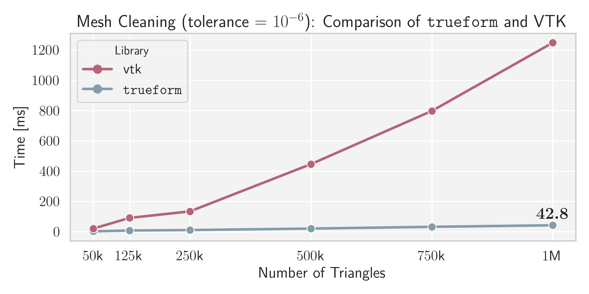
  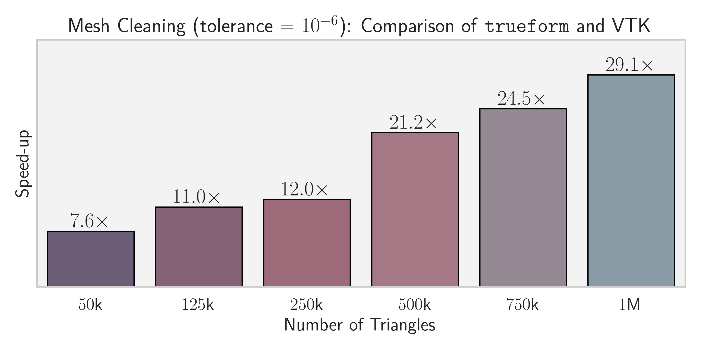
</p>

Index maps can be used to reindex other data you might have:

```c++
// Use any primitive range, e.g., unit_vectors
auto reindexed_normals = tf::reindexed(normals, index_map);

std::vector<std::string> attributes;
auto reindexed_attributes =
    tf::reindexed(tf::make_range(attributes), index_map);
```

You can also reindex by **IDs** or by **mask**:

```c++
auto sub_polygons = tf::reindexed_by_mask<int>(triangles, mask);
auto [sub_polygons, face_index_map, point_index_map] =
    tf::reindexed_by_mask<int>(triangles, mask, tf::return_index_map);
```

For `tf::polygons` and `tf::segments` we additionally provide `reindexed_by_ids_on_points` and `reindexed_by_mask_on_points`, which filter based on point inclusion.


### 🧩 Topology

Define topological connectivity over raw primitives for richer geometric queries and traversal. `trueform` supports composable connectivity structures to enable mesh-level logic like membership, linking, and boundary traversal:

```c++
tf::face_membership<int> face_membership;
face_membership.build(polygons);
tf::manifold_edge_link<int, 3> manifold_edge_link;
manifold_edge_link.build(polygons, face_membership)
```
You can attach them to a primitive range or a `form` using `tf::tag` for use in topology-aware algorithms:
```c++
auto t_polygons = polygons
    | tf::tag(face_membership)
    | tf::tag(manifold_edge_link);

auto paths = tf::make_boundary_paths(t_polygons);
auto curves = tf::make_curves(paths, t_polygons.points());
```

See how it compares with `VTK` (on *Intel i7-9750H*):

<p float="left">
  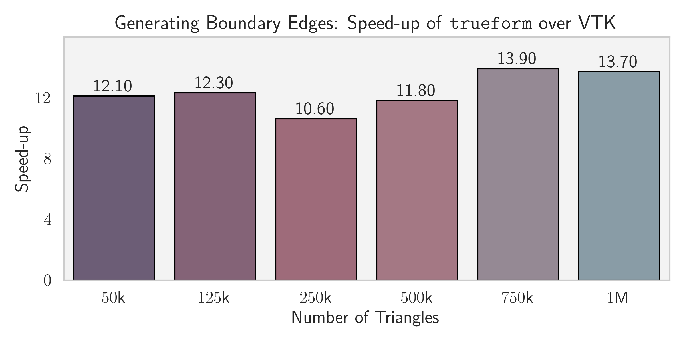
  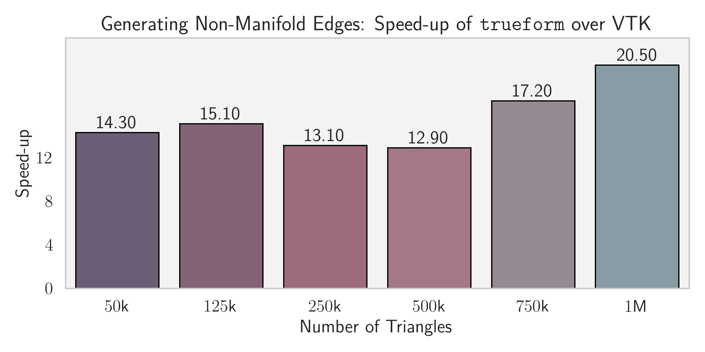
</p>

#### 🔗 Labeling Connected Components

Label connectivity-based regions using any traversal rule. For example, `manifold_edge_link` ensures components are only connected through manifold edges:

```c++
auto n_components = tf::label_connected_components(
    labels_range, tf::make_applier(manifold_edge_link));
```

See how it compares with `CGAL` (on *Intel i7-9750H*):

<p float="left">
  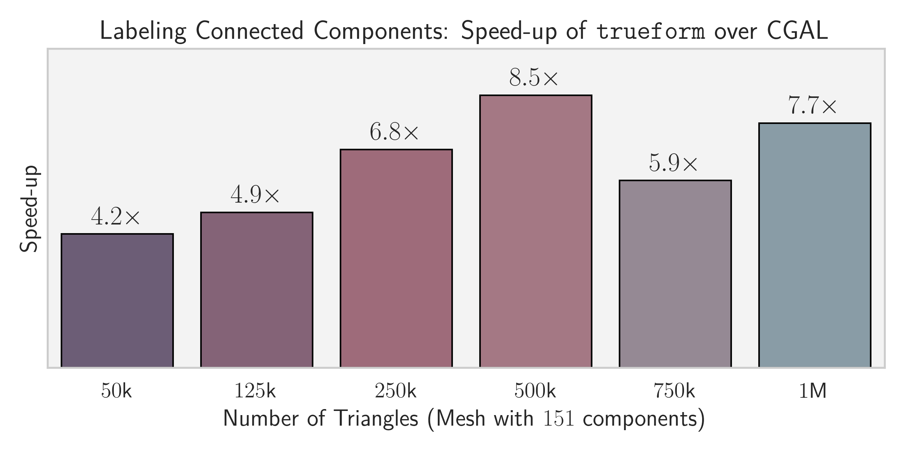
  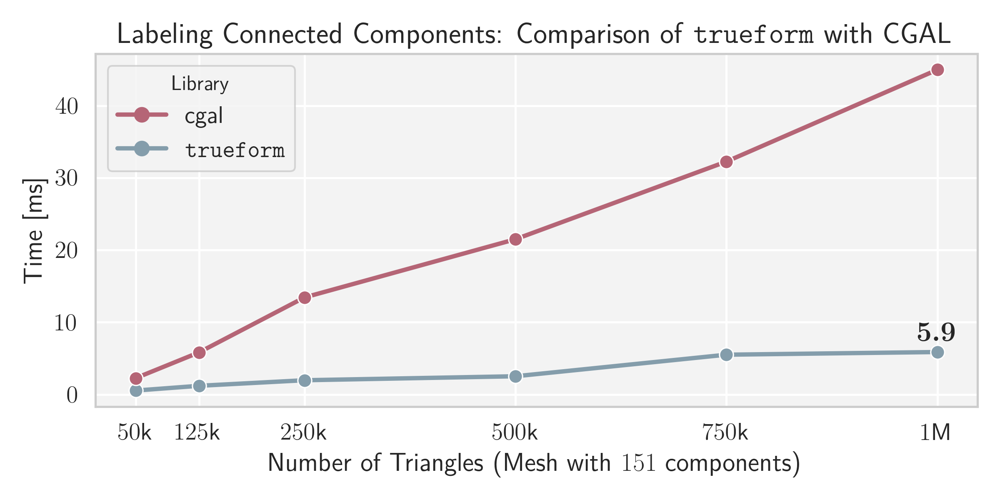
</p>

#### 🔄 Planar Embeddings and Graph Regions

Efficiently extract oriented faces and hole relations from ordered edges.

```c++
tf::planar_embedding<int, double> pe;
pe.build(edges, points);

for (auto [face, hole_ids] :
    tf::zip(pa.faces(), pe.holes_for_faces()))
  for (auto hole : tf::make_indirect_range(hole_ids, pa.holes()));
```

#### Tutorial: Topology

See [Tutorial: Topology](./docs/tutorial.md#topology) for a detailed walk-through and additional features like `tf::vertex_link`, `tf::face_link`, and `tf::planar_graph_regions`. Additional examples are provided in the [examples directory](./examples/).

### ✂️ Intersections

Detect exact geometric intersections — from scalar field slices to full polygonal collisions — with simple, expressive calls.

#### 🗺️ Planar Arrangements

Efficiently extract oriented faces and hole relations from unordered 2D edge soups.

```c++
tf::planar_arrangments<int, double> pa;
pa.build(segments);

for (auto [face, hole_ids] :
    tf::zip(pa.faces(), pa.holes_for_faces())){
    auto polygon = tf::make_polygon(face, pa.points());
    for (auto hole : tf::make_indirect_range(hole_ids, pa.holes())) {
      auto hole_polygon = tf::make_polygon(hole, pa.points());
    }
}
```

See how it compares with `CGAL` (on *Intel i7-9750H*):

<p float="left">
  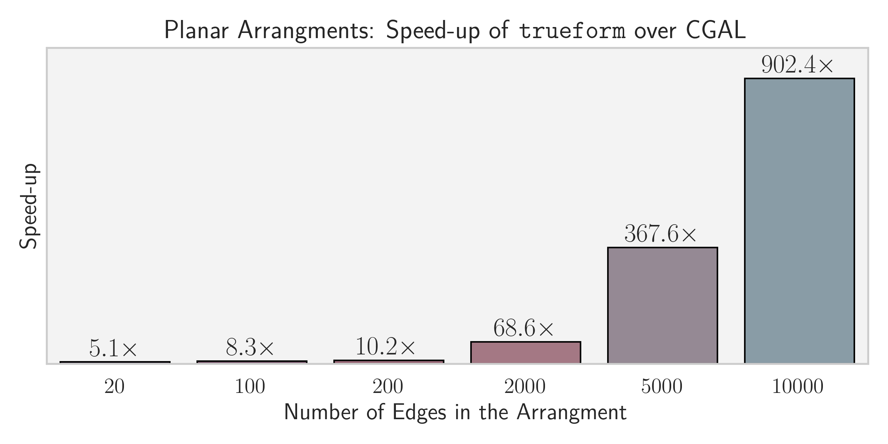
  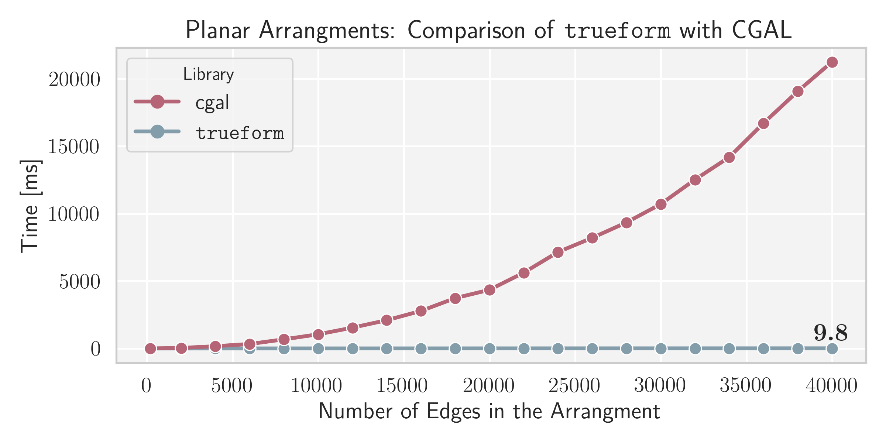
</p>

#### 🔸 Scalar Field Intersections and Contours

Slice polygonal geometry using a scalar field (e.g., height, temperature, distance). Outputs interpolated intersection points:

```c++
auto curves = tf::make_isocurves(polygons, scalar_field, range_of_cut_values);
```

See how it compares with `VTK` (on *Intel i7-9750H*):

<p float="left">
  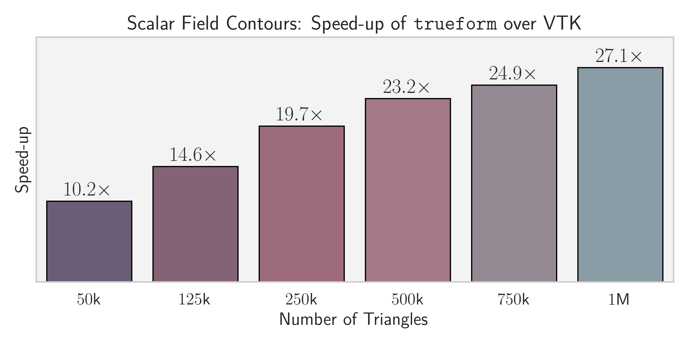
  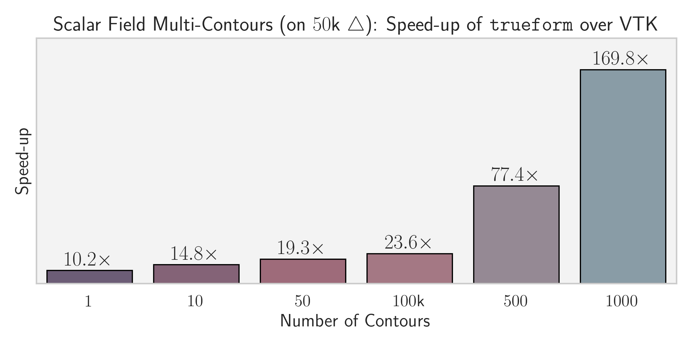
</p>

#### ✖️ Mesh-Mesh Intersections

Detect all intersections between two polygonal `forms` — transformed or static:
```c++
auto curves = tf::make_intersection_curves(
                form0 | tf::tag(face_membership0) | tf::tag(manifold_edge_link0),  
                form1 | tf::tag(face_membership1) | tf::tag(manifold_edge_link1));
```

See how it compares with `VTK` and `CGAL` when continuously computing the intersection curve between two moving meshes (on *Intel i7-9750H*):

<p float="left">
  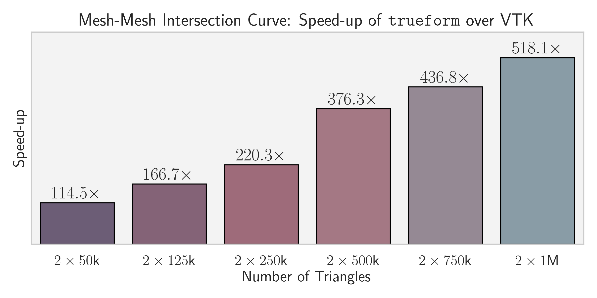
  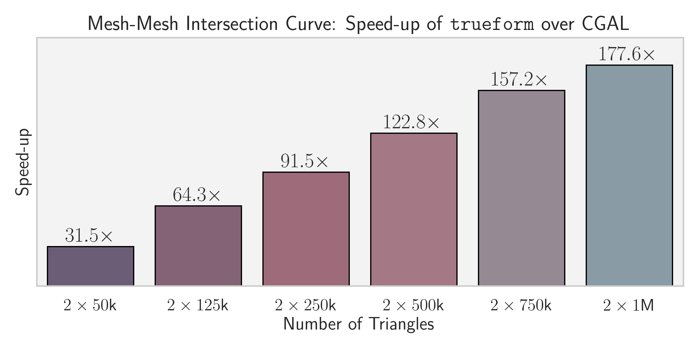
</p>


#### Tutorial: Intersections

See [Tutorial: Intersections](./docs/tutorial.md#intersect) for a walk-through and additional features. Additional examples are provided in the [examples directory](./examples/).

## Getting Started

### Requirements

* **C++17** or later
* **Intel TBB** (Threading Building Blocks) for parallelism

### Installation

`trueform` is a header-only library. The recommended way to integrate it into your project is with CMake's `FetchContent`.

Add the following to your `CMakeLists.txt`:

```cmake
include(FetchContent)

FetchContent_Declare(
  trueform
  GIT_REPOSITORY https://github.com/xlabmedical/trueform.git
  GIT_TAG        main
)

FetchContent_MakeAvailable(trueform)

target_link_libraries(my_target PRIVATE tf::trueform)
```

## Documentation
We provide two main resources to help you get started and master trueform:

### [Tutorial](./docs/tutorial.md)

**This is the best place to start.** It's a comprehensive document that serves as both a guided tour of the library's philosophy and a complete reference manual for the `core`, `spatial`, `topology`, and `intersect` modules.

### [Examples](./examples/)

For hands-on, practical applications, explore the examples directory. It contains a collection of standalone programs organized into three categories:
* **Core Functionality**: Self-contained demonstrations of primary features.
* **Comparisons**: Performance and usage comparisons against libraries like `VTK`, `CGAL` and `nanoflann`.
* **VTK Integration**: Guides for using `trueform` with tools like `VTK`.

## Publications

- > **tf::tree: A General-Purpose Spatial Hierarchy for Real-Time Geometry Queries.**  
Žiga Sajovic, Dejan Knez, and Robert Korez.  
*Institute of Electrical and Electronics Engineers (IEEE),* June 2025.  
[https://doi.org/10.36227/techrxiv.174952959.92977743/v1](https://doi.org/10.36227/techrxiv.174952959.92977743/v1)

- > **Real-Time Mesh Booleans that Commute with Mesh Idealization.**  
Žiga Sajovic and Dejan Knez  
 *Institute of Electrical and Electronics Engineers (IEEE),* May 2025.  
 [https://doi.org/10.36227/techrxiv.174667714.42575478/v1](https://doi.org/10.36227/techrxiv.174667714.42575478/v1)
