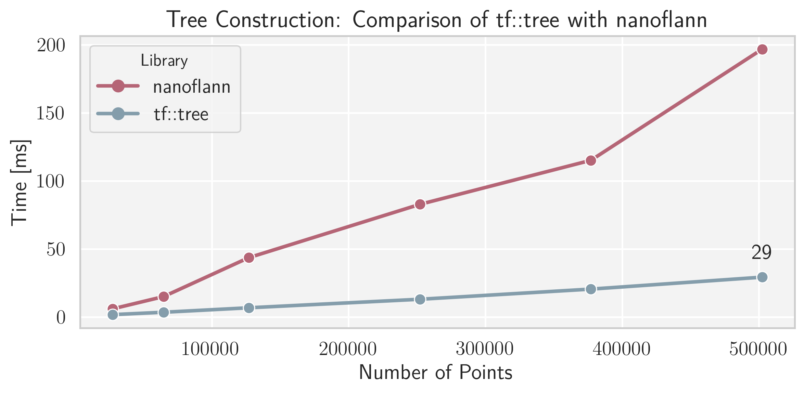
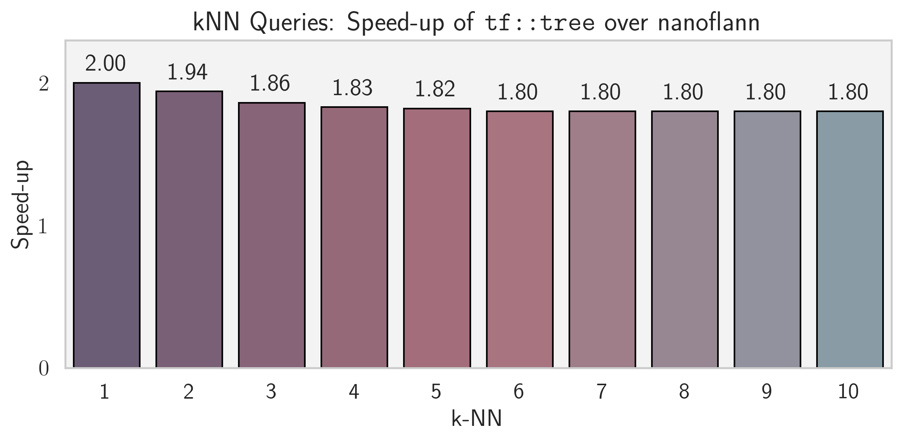
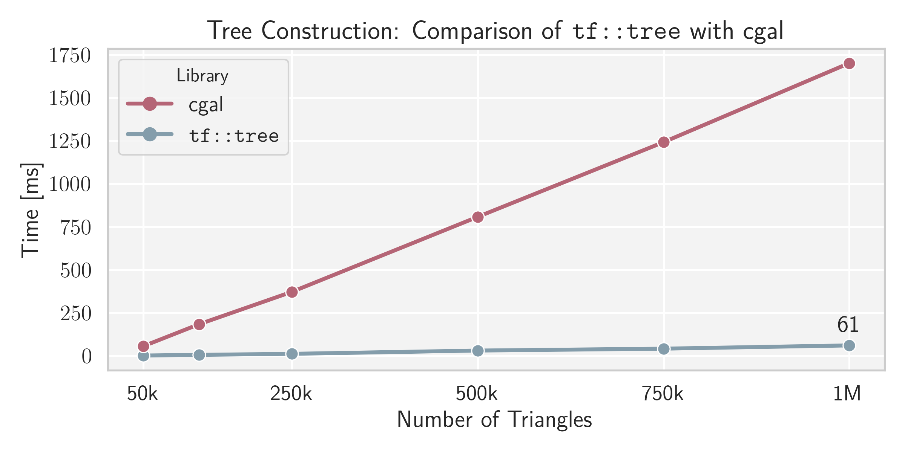
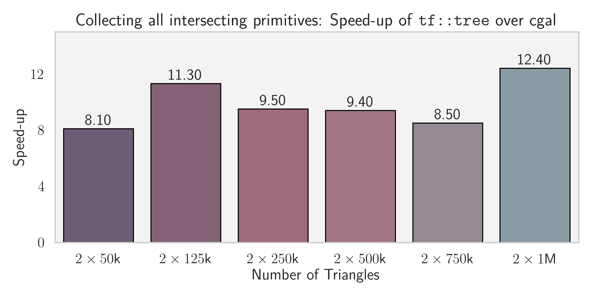

# Tutorial

`trueform` is a C++ library for real-time geometric processing, built on the principles of composable views and inline policy injection. It operates directly on you *plain-old-data*, by providing semantic views that wrap it with geometric meaning. From individual primitives to structured ranges, from meta-data injection to spatial queries, every operation happens directly on your data; enriched with semantics without architectural changes.

The library integrates directly at the call site: no boilerplate, no architectural rewrites, no heavyweight setup. It acts as a lightweight, expressive layer over your existing data. Like C++ ranges or lambdas, it lets you build rich, semantic geometry inline, without sacrificing performance or control.

### Simplifying Common Tasks

`trueform` can serve as a simpler, faster replacement for common operations you already perform with other libraries. For example, you can replace `nanoflann` for *k-NN* queries with just a few lines of code:
```c++
std::vector<float> raw_points;
auto pts = tf::make_points<3>(raw_points);
tf::tree<int, float, 3> point_tree(pts, tf::config_tree(4, 4));
auto query_pt = tf::random_point<float, 3>();
std::array<tf::nearest_neighbor<int, float, 3>, 10> knn_buffer;
tf::neighbor_search(tf::make_form( // optional_transformation,
                        point_tree, pts),
                    query_pt,
                    tf::make_nearest_neighbors(knn_buffer.begin(), 10 /*, search_radius*/));
```

<p float="left">
  
  
</p>

or replace your use of `CGAL` for *mesh-intersection* queries with an equally minimal call — and significantly faster execution:
```c++
std::vector<int> raw_triangle_ids;
auto triangles = tf::make_polygons(
    tf::make_blocked_range<3>(raw_triangle_ids), pts);
tf::tree<int, float, 3> tree(triangles, tf::config_tree(4, 4));
std::vector<std::pair<int, int>> intersecting_primitives;
tf::gather_ids(
    tf::make_form(tree, triangles),
    tf::make_form( // M.dot(x - pts[0]) + pts[10]
        tf::random_frame_at(pts[0], pts[10]), tree, triangles),
    tf::intersects_f, std::back_inserter(intersecting_primitives));
```
<p float="left">
  
  
</p>

This reflects `trueform`’s design principles: it’s meant to feel like composing ranges and lambdas — inline, expressive, and non-invasive. 

### Showcase: The Power of Composition

While `trueform` can replace existing tools, its real power is its expressive, compositional API. Consider a common challenge: modeling a moving point cloud of "emitters." Each emitter needs a unique ID, a static mounting normal, a dynamic aiming direction, and a color—all sourced from different data vectors. With `trueform`, this complex assembly becomes a single, readable pipeline:
```c++
// --- Raw Data ---
std::vector<float> raw_pts;
std::vector<float> raw_normals;
std::vector<std::string> ids;
std::vector<float> raw_direction;
std::vector<std::array<float, 3>> colors;

// --- Composition Pipeline ---
// Start with raw points and progressively enrich them with semantics.
auto emitters =
    tf::make_points<3>(raw_pts)
    // 1. Tag the entire collection with a single ID.
    | tf::tag_id("emitter_array_alpha")
    // 2. Zip per-element data onto the range.
    | tf::zip_ids(ids)
    | tf::zip_normals(
          tf::make_unit_vectors<3>(raw_normals)
          // Policies can be nested: tag the zipped normals themselves.
          | tf::tag_id("mount_normals"))
    // 3. Zip a composite state from multiple data sources.
    | tf::zip_states(
          tf::make_unit_vectors<3>(raw_direction)
          | tf::tag_id("aim_directions"),
          tf::make_view(colors)
          | tf::tag_id("color_data"));
```
The `emitters` object still behaves like a simple range of points, compatible with any algorithm on point primitives. The real power is realized in the query, where its attached policies are correctly preserved or transformed, enabling complex, stateful logic:
```c++
// --- Using the Enriched Object in a Query ---
tf::tree<int, float, 3> emitter_tree{emitters, tf::config_tree(4, 4)};
tf::frame<float, 3> frame = tf::random_transformation<float, 3>();
auto query_pt = tf::random_point<float, 3>() | tf::tag_id("target");

float aim_radius2 = 4.0f; // Use squared distance for performance
float aim_cos_angle = 0.95f;

tf::search(
    // The form applies the dynamic frame to the static tree and emitters.
    tf::make_form(frame, emitter_tree, emitters),
    // Broad-phase: Quickly cull any nodes outside the target radius.
    [&](const auto &aabb) {
        return tf::distance2(aabb, query_pt) < aim_radius2;
    },
    // Narrow-phase: The "brain" of the query. Evaluate each potential
    // emitter.
    // auto transformed_emitter = tf::transformed(emitters.front(), frame);
    [&](const auto &transformed_emitter) {
        if (tf::distance2(transformed_emitter, query_pt) >= aim_radius2)
        return;
        // Access all the policy data, which has been correctly handled.
        const auto &id =
            transformed_emitter.id(); // The per-emitter ID is preserved.
        const auto &mount_normal =
            transformed_emitter.normal(); // The normal vector is transformed.
        // `direction` was transformed, while `color` was passed through
        // unchanged.
        const auto &[aim_direction, color] = transformed_emitter.state();
        auto to_target = tf::normalized(query_pt - transformed_emitter);
        // Check if the target is in the turret's firing arc and aimed
        // correctly.
        if (tf::dot(to_target, mount_normal) > 0 &&
            tf::dot(to_target, aim_direction) > aim_cos_angle) {

        std::cout << "Emitter " << id << " can hit " << query_pt.id()
                    << "!\n";
        }
    });
```
The result is a highly expressive, architecture-agnostic approach to geometry that integrates into your existing code.

## Core

At its core, `trueform` is a collection of geometric primitives that view your data, and ranges of these primitives. The primitives and their ranges can be injected with additional semantics
```
      primitive<Dims, Policy0> → ... → primitive<Dims, Policy_n>
                                                      ↓
primitive_range<Dims, Policy0> → ... → primitive_range<Dims, Policy_n>
                                                      ↓
                                              form<Dims, Policy>
                                                ↑           ↑
                                               tree       frame ← transformation
                                                            ↑
                                                  inverse_transformation
```

### Primitives

> **primitive** → primitive_range → form

`trueform` provides a set of geometric primitives, including points, vectors, lines, polygons, AABBs, and transformations. Every primitive is a template of the form:
```c++
primitive<std::size_t(Dims), Policy>
```
The `Policy` parameter is the engine of the library, defining the primitive's behavior (e.g., whether it owns its data or just views it, does it have a normal, does it have state, etc) and enabling extensions. The underlying coordinate type (e.g., float, double) can be extracted from any policy:

```c++
// Deduces the scalar type from one or more policies
using common_t = tf::coordinate_type_t<Policy0, Policy1>;
common_t scalar = 2.0;
```

> **See:** All primitives may be tagged with additional semantics, as we will learn when we learn about [policies](#policies).

#### Points and Vectors

These are the most fundamental primitives, provided in three main variations:

| Concept         | General Template                     | Owning Alias                  | View Alias                         |
| --------------- | ------------------------------------ | ----------------------------- | ---------------------------------- |
| **Vector**      | `tf::vector_like<Dims, Policy>`      | `tf::vector<Type, Dims>`      | `tf::vector_view<Type, Dims>`      |
| **Unit Vector** | `tf::unit_vector_like<Dims, Policy>` | `tf::unit_vector<Type, Dims>` | `tf::unit_vector_view<Type, Dims>` |
| **Point**       | `tf::point_like<Dims, Policy>`       | `tf::point<Type, Dims>`       | `tf::point_view<Type, Dims>`       |

Factory functions like `tf::make_vector` and `tf::make_vector_view` create these primitives.

```c++
tf::vector<float, 3> v0{1.f, 1.f, 1.f};
float buf[3]{2, 2, 2};
auto vview0 = tf::make_vector_view(buf);
auto vview1 = tf::make_vector_view<3>(&buf[0]);

//
tf::unit_vector<float, 3> uv0{v0};
auto uv1 = tf::make_unit_vector(v0);
auto uv2 = tf::make_unit_vector(vview0);

// this will not normalize
auto uv3 = tf::make_unit_vector(tf::unsafe, v0);
auto uv4 = tf::make_unit_vector_view(uv0);

//
tf::point<float, 3> pt0{{4, 4, 4}};
auto pview0 = tf::make_point_view(buf);
auto pview1 = tf::make_point_view<3>(&buf[0]);
```

They all support standard geometric algebra (the appropriate subset of operations `+`, `-`, `*`), conversions (`.as<T>()`), and essential functions like `tf::dot` and `tf::cross`.

> **NOTE:** Points support a narrows subset of vector algebra (i.e. `pt + pt` is a nonsensical operation). If the full set is needed (such as computing a centroid), you may view the point_like, as a vector_like using `pt.as_vector_view()`.

#### Line and Ray

Lines and rays are a composite of a point `origin` and a vector `direction`.

| Concept         | General Template                     | Owning Alias                  | 
| --------------- | ------------------------------------ | ----------------------------- | 
| **Line**        | `tf::line_like<Dims, Policy>`        | `tf::line<Type, Dims>`        |
| **Ray**         | `tf::ray_like<Dims, Policy>`         | `tf::ray<Type, Dims>`         |


There are no view aliases because a call to `make_line_like(point_like, vector_like)` will produce a view, when
the inputs are views. The factory `make_line` always returns an owning alias, as does `make_line_between_points`. Furthermore, the `line_like` is convertible to a line. The same holds true for rays.

They additionally support an `operator()(tf::coordinate_type<Policy> t): origin + t * direction`

#### Plane

A plane is a composite of a `unit_vector_like<Dims, Policy>` normal and a `tf::coordinate_type<Policy>` d, where `d` is the negative dot product between the normal and a point in the plane.

| Concept          | General Template                      | Owning Alias                   | 
| ---------------- | ------------------------------------- | ------------------------------ | 
| **plane**        | `tf::plane_like<Dims, Policy>`        | `tf::plane<Type, Dims>`        |


There are no view aliases because a call to `make_plane_like(unit_vector_like, coordinate_type)` will produce a view, when
the inputs are views. The factory `make_plane` always returns an owning alias.

```c++
tf::point<float, 3> pt;
tf::unit_vector<float, 3> normal;
auto plane0 = tf::make_plane(pt, pt, pt);
auto plane1 = tf::make_plane(normal, pt);
auto plane2 = tf::make_plane(normal, -tf::dot(normal, pt));
```

Furthermore, the `plane_like` is convertible to a `tf::plane`

#### Segment

A `tf::segment<Dims, Policy>` is a wrapper around a policy that behaves as a range of `tf::point_like`, with compile-time size of `2`. There are several ways to create one:

```c++
// creates copies of the two points
auto seg0 = tf::make_segment_between_points(pt0, pt1);
auto [seg0_pt0, seg0_pt1] = seg0;

std::array<tf::point<float, 3>, 2> r; // any range of two points
auto seg1 = tf::make_segment(r);
```

Or, if you have edges that index into a larger range of points:

```c++
std::array<int, 2> ids{0, 1};
auto seg2 = tf::make_segment(ids, r);

// ids are a view, as are the points
auto [id0, id1] = seg2.indices();
auto [seg2_pt0, seg2_pt1] = seg2;
```

#### Polygon

A `tf::polygon<Dims, Policy>` is a wrapper around a policy that behaves as a range of `tf::point_like`. When the policy has has a static size, so does the polygon. There are several ways to create one:

```c++
std::array<tf::point<float, 3>, 3> r;
auto polygon0 = tf::make_polygon(r);
```

Or, if you have faces that index into a larger range of points:

```c++
std::array<int, 3> ids{0, 1, 2};
auto polygon1 = tf::make_polygon(ids, r);

// ids are a view, as are the points
auto [id0, id1, id2] = polygon1.indices();
auto [pt0, pt1, pt2] = seg2;
```

> **NOTE**: Polygons use `tf::static_size` internally to determine the static size of the range being passed into it. All `tf` ranges propagate this static information. We still offer an overload `tf::make_polygon<V>` where the user manually supplies this information.

> **See:** [Policies](#policies) to see how to inject normals and planes into polygons.

#### AABB

An axis-aligned-bounding-box is a composite of a point_like `min` and a point_like `max`, representing the minimal and maximal corners.

| Concept         | General Template                     | Owning Alias                  | 
| --------------- | ------------------------------------ | ----------------------------- | 
| **aabb**        | `tf::aabb_like<Dims, Policy>`        | `tf::aabb<Type, Dims>`        |


There are no view aliases because a call to `make_aabb_like(point_like, point_like)` will produce a view, when
the inputs are views. The factory `make_aabb` always returns an owning alias. Furthermore, the `aabb_like` is convertible to a `tf::aabb`

It additionally supports `::diagonal()`, `::center()`, and `::size()` methods.

##### AABB of Primitives

To create an `aabb` of a finite primitive:

```c++
tf::aabb<float, 3> aabb = tf::aabb_from(primitive);
```

### Transformations and Frames

A `transformation` consists of a rotation `R` and a translation `t`. It maps points and vectors according to the table below:

| **Type**       | **Mapping**        |
|----------------|--------------------|
| `point_like`   | `R.dot(pt) + T`    |
| `vector_like`  | `R.dot(vec)`       |

Similarly to points and vectors, transformations may own, or view your data

| Concept            | General Template                      | Owning Alias                    | View Alias                    | 
| ------------------ | ------------------------------------- | ------------------------------- |  ------------------------------- |
| **transformation** |`tf::transformation_like<Dims, Policy>`| `tf::transformation<Type, Dims>`| `tf::transformation_view<Dims, Policy>`

A `transformation_like` is convertible to a `transformation`.
```c++
tf::transformation_view<float, 3> tr_view{float_ptr};
tf::transformation<float, 3> tr{tr_view};
tr.fill(other_float_ptr);
```
the memory layout of a transformation pointer is `Dims` rows of `Dims+1` columns, where the last element of a row a translation of that dimension. The `coordinate type` is again accessible through `tf::coordinate_type<Policy>`.


We also provide two convenience factories: `tf::make_identity_transformation` and `tf::make_transformation_from_translation`.

---

A `frame_like<Dims, Policy>` is a composition of a transformation and its inverse: 

| Concept   | General Template             | Owning Alias           | 
| --------- | ---------------------------- | ---------------------- |
| **frame** |`tf::frame_like<Dims, Policy>`| `tf::frame<Type, Dims>`|

There are no view aliases because a call to `make_frame_like(transformation_like, transformation_like)` will produce a view, when
the inputs are views. The factory `make_frame` always returns an owning alias.

```c++
tf::frame<float, 3> frame0;
tf::frame<float, 3> frame1{tr_view};
```
The `coordinate type` is again accessible through `tf::coordinate_type<Policy>`.

Additionally, `tf::frame` uses a safe policy that ensures the inverse is always computed after changes. This means that to alter the transformation in a frame, you must use 

```c++
frame.fill(float_ptr/*, ptr for inverse*/);
frame.set(transformation /*, inverse_transformation*/);
```

The general `tf::frame_like` offers no such guarantees, but is convertible to a `tf::frame`.

#### Transforming primitives

Any primitive from the `tf::` namespace can be transformed using `tf::transformed(_this, _by_transformation)`. Transformations can be performed using either `tf::transformation` or `tf::frame`. This includes composing transformations:

```c++
auto tr0 = tf::random_transformation<float>();
auto tr1 = tf::random_transformation<float>();
auto tr1_dot_tr0 = tf::transformed(tr0, tr1);
```

### Queries of Primitives

`trueform` provides a set of queries that work across all compatible primitive types.

#### General queries

All pairs of primitives support the following queries:

| **Query**                 | **Returns**                         |
|---------------------------|-------------------------------------|
|`distance2`                |Squared distance between primitives  |
|`distance`                 |Distance between primitives          |
|`closest_metric_point`     |`tf::metric_point` (on left argument)|
|`closest_metric_point_pair`|`tf::metric_point_pair`              |
|`intersects`               |Do the primitives intersect          |

A `tf::metric_point` is a composite of a `metric` and a `point`, while `tf::metric_point_pair` is a composite of a `metric`,  `point` first and `point` second.

```c++
auto [dist2, pt_on_poly0, pt_on_poly1] =
    tf::closest_metric_point_pair(polygon0, polygon1);
```

#### Point classification queries

A point may be classified (using `tf::classify`) against a plane and polygon, and additionally against a line, ray and segment in 2D. The function returns either a `tf::sidedness`, or a `tf::containment` enum, depending on the context.

#### Ray casting

We distinguish two types of ray operations: `ray_cast` (`intersection_status` and `t`) and `ray_hit` (`intersection_status`, `t` and the `tf::point` of the hit).

Both are supported between a ray and all other primitive types.

```c++
auto seg = tf::make_segment_between_points(tf::random_point<float, 3>(),
                                            tf::random_point<float, 3>());
auto ray = tf::make_ray_between_points(tf::random_point<float, 3>(),
                                        tf::random_point<float, 3>());
// only consider the t \in [1, 2] as valid. The config may be omitted
auto r_cast = tf::ray_cast(ray, seg, tf::make_ray_config(1.f, 2.f));
if (r_cast) {
auto [status, t] = r_cast;
}
auto r_hit = tf::ray_hit(ray, seg, tf::make_ray_config(1.f, 2.f));
if (r_hit) {
auto [status, t, point] = r_hit;
}
```

### Primitive Ranges

> primitive → **primitive_range** → form


`trueform` provides a set of semantic ranges over primitives. Every primitive_range is a template of the form:
```c++
primitive_range<std::size_t(Dims), Policy>
```
The `Policy` parameter defines the primitive_range's behavior (e.g. does it have normals, does it have state, does it have connectivity structures like vertex_link, etc) and enables extensions. These will be presented in [Policies](#policies). The underlying coordinate type (e.g., float, double) can be extracted from any policy:

```c++
// Deduces the scalar type from one or more policies
using common_t = tf::coordinate_type_t<Policy0, Policy1>;
common_t scalar = 2.0;
```

#### General Range View Adaptors

While `trueform` is not a range-adaptor library, it provides several range adaptors that allow you to work with your existing data layout directly. Our adaptors preserve and propagate static size information, which can be accessed via `tf::static_size`. Here are a few common examples:

```c++
std::vector<int> raw_ids;
auto triangle_faces0 = tf::make_blocked_range<3>(raw_ids);
auto [t0id0, t0id1, t0id2] = triangle_faces0.front();
// or if the ids are in legacy VTK format (3, a, b, c, 3, e, f, g)
auto triangle_faces1 = tf::make_tag_blocked_range<3>(raw_ids);
auto [t1id0, t1id1, t1id2] = triangle_faces0.front();
//
auto segments0 = tf::make_blocked_range<2>(raw_ids);
auto [s0id0, s0id1] = segments0.front();
// or if the ids are a sequence of curve points
auto segments1 = tf::make_slide_range<2>(raw_ids);
auto [s1id0, s1id1] = segments1.front();
```

To create a view of your data:
```c++
auto r0 = tf::make_view(your_container);
// if you know it has n-elements and this
// is not known to tf::static_size
auto r1 = tf::make_view<N>(your_container);
```

#### Points and Vectors

These are the most fundamental primitive ranges, provided in three variants:

|Concept     |Template                  |Factory          |
|------------|--------------------------|-----------------|
|vectors     |vectors<Dims, Policy>     |make_vectors     |
|unit vectors|unit_vectors<Dims, Policy>|make_unit_vectors|
|points      |points<Dims, Policy>      |make_points      |

The factories can take flat ranges as inputs:
```c++
std::vector<float> raw_pts;
auto pts = tf::make_points<3>(raw_pts);
tf::point_view<float, 3> pt = pts.front();
```
Or simply wrap ranges already containing the concerning primitive:
```c++
std::vector<tf::point<float, 3>> pts0;
auto pts = tf::make_points(pts0);
```

> **NOTE:** The `points<Dims, Policy>` provide an additional method `.as_vector_view()`, when one needs complete vector algebra over their points.

> **See:** Points and vectors may be tagged with additional semantics (normals, ids, state, topological connectivity, etc), as we will learn when we learn about [policies](#policies).

#### Segments

Curves and embedded graphs are modeled by a range of segments:

|Concept      |Template              |Factory          |
|-------------|----------------------|-----------------|
|segments     |segments<Dims, Policy>|make_segments    |

The factory is used in conjunction [General View Adaptors](#general-range-view-adaptors):

```c++
// from a sequence of edges
auto segments0 = tf::make_segments(tf::make_blocked_range<2>(points));
// from a sequence of points
auto segments1 = tf::make_segments(tf::make_slide_range<2>(points));

```
We can use ids to index into a larger array of points:
```c++
std::vector<int> ids;
auto segments2 = tf::make_segments(tf::make_blocked_range<2>(ids), points);
auto segments3 = tf::make_segments(tf::make_slide_range<2>(ids), points);
```
The segment elements behave [as expected](#segment):
```c++
auto [s3pt0, s3pt1] = segments3.front();
auto [s3_id0, s3_id1] = segments3.front().indices();
```
We additionally get two methods, `.edges()` and `.points()`:
```c++
auto [s3_id0_, s3_id1_] = segments3.edges().front();
auto points_range = segments3.points();
```

> **See:** Segments may be tagged with additional semantics (normals, ids, state, topological connectivity, etc), as we will learn when we learn about [policies](#policies).

#### Polygons

Meshes are modeled by a range of segments:

|Concept      |Template              |Factory          |
|-------------|----------------------|-----------------|
|polygons     |polygons<Dims, Policy>|make_polygons    |

The factory is used in conjunction [General View Adaptors](#general-range-view-adaptors):
```c++
// from a sequence of points
auto polygons0 = tf::make_polygons(tf::make_blocked_range<3>(points));
auto [p0pt0, p0pt1, p0pt2] = polygons0.front();
```
We can use ids to index into a larger array of points:
```c++
std::vector<int> ids;
auto polygons1 = tf::make_polygons(tf::make_blocked_range<3>(ids), points);
// or if the ids are in legacy VTK format (3, a, b, c, 3, e, f, g)
auto polygons2 =
    tf::make_polygons(tf::make_tag_blocked_range<3>(ids), points);
```
The polygons elements behave [as expected](#polygon):
```c++
auto [p2pt0, p2pt1, p2pt2] = polygons2.front();
auto [p2_id0, p2_id1, p2_id2] = polygons2.front().indices();
```
We additionally get two methods, `.faces()` and `.points()`:
```c++
auto [p2_id0_, p2_id1_, p2_id2_] = polygons2.faces().front();
auto points_range = polygons2.points();
```

> **See:** Polygons may be tagged with additional semantics (normals, ids, state, topological connectivity, etc), as we will learn when we learn about [policies](#policies).

### Policies

The `trueform` policy system allows you to compositionally add semantic information and behavior to primitives and ranges. This is achieved through two main operations, `tag` and `zip`, which are designed to feel like building up an object with a clean, expressive pipeline.

A policy operation maps an object to a new version with an enriched policy:
> object_t<Policy> -> object_t<new_policy<Policy>>

These operations are **hierarchy-idempotent**: applying the same policy twice has no additional effect, making them safe to use in generic code.

> **NOTE:** Topological policies will be presented in [Topology](#topology).

#### Policy tag

A `tag` applies a single piece of metadata to an entire object, whether it's a single primitive or a range of primitives. We support tagging with an `id`, `normal`, `plane`, and `state`.

This enables you to build up a complex object on-the-fly. For example, here we create a single point and enrich it with an ID, a normal (which itself has an ID), and a composite state made from a direction and a color.

```c++
auto base_pt = tf::random_point<float, 3>();
auto point_normal = tf::normalized(tf::random_vector<float, 3>());
auto direction = tf::normalized(tf::random_vector<float, 3>());
std::array<float, 3> color;
auto point = base_pt                        
                | tf::tag_id("point")          
                | tf::tag_normal(point_normal | tf::tag_id("normal"))
                | tf::tag_state(direction, color);
```
Even after being enriched, the `point` is still a `point_like<3, Policy>` and can be used in any geometric calculation. Policies are preserved and correctly transformed through transformations (i.e. the normal and the direction component of the state are transformed).
```c++
// still behaves like a point
point += tf::random_vector<float, 3>();
auto d2 = tf::distance2(point, tf::random_point<float, 3>());
// Transformations correctly handle the object and its policies.
tf::frame<float, 3> frame = tf::random_transformation<float, 3>();
auto transformed_point = tf::transformed(point, frame);

const auto &id = transformed_point.id();
const auto &transformed_normal = transformed_point.normal();
const auto &transformed_normal_id = transformed_normal.id();
const auto &[transformed_direction, same_color] = transformed_point.state();
```

#### Policy zip

A `zip` operation applies per-element data to a `primitive_range`. It effectively "zips" a range of data (like normals or IDs) with the range of primitives, so that each primitive in the range gets its own corresponding piece of data, i.e.:
```c++
primitive_range_t<..., zip_x<Policy>>::reference =
     tag_x<primitive_range<Policy>::reference>
```

We support zipping with `ids`, `normals`, and `states` on [primitive range](#primitive-ranges).
For example, to create`tf::points` where each point has its own `normal`, `id` and a `state` consisting of a direction and a color array:


```c++
std::vector<float> raw_pts;
std::vector<float> raw_normals;
std::vector<std::string> ids;
std::vector<float> raw_direction;
std::vector<std::array<float, 3>> colors;

auto points =
    tf::make_points<3>(raw_pts)                              
    | tf::tag_id("enriched points")                          
    | tf::zip_ids(ids)                                       
    | tf::zip_normals(tf::make_unit_vectors<3>(raw_normals)) 
    | tf::zip_states(tf::make_unit_vectors<3>(raw_direction), colors);

const auto & [directions_, colors_] = points.states();
const auto &id_ = points.id();
const auto &ids_ = points.ids();
const auto &normals_ = points.normals();
```

The `points` are still a `tf::points<Policy>` and behave like one
```c++
auto transformed_point = tf::transformed(points.front(), frame);
const auto &id = transformed_point.id();
const auto &transformed_normal = transformed_point.normal();
const auto &[transformed_direction, color_t] = transformed_point.state();
```

#### Plain primitives and primitive ranges

To remove all policies from an object:

```c++
auto plain_points = points | tf::plain();
```

## Spatial

Spatial module extends the [Queries on Primitives](#queries-of-primitives) to primitive ranges by introducing [Forms](#forms), that bundle a [primitive range](#primitive-ranges), a [Frame](#transformations-and-frames) and a [Spatial structure](#spatial-structures).

## Spatial Structures

We distinguish between two types of spatial structures: those that support modification (e.g., for live editing of a mesh) and those that do not.

### `tf::tree`

`tf::tree<Index, RealType, Dims>` is a high-performance spatial hierarchy designed for real-time geometry queries, introduced in:

> Žiga Sajovic, Dejan Knez, and Robert Korez.  
> **tf::tree: A General-Purpose Spatial Hierarchy for Real-Time Geometry Queries.**  
> *Institute of Electrical and Electronics Engineers (IEEE),* June 2025.  
> [https://doi.org/10.36227/techrxiv.174952959.92977743/v1](https://doi.org/10.36227/techrxiv.174952959.92977743/v1)

#### Building the Tree

To construct a tree, provide a [primitive range](#primitive-ranges) and a configuration specifying the arity (number of children per node) and the maximum number of primitives in a leaf.

```c++
tf::tree<int, float, 3> tree(primitive_range, tf::config_tree(4, 4));
// or
tree.build(primitive_range, tf::config_tree(4, 4));
```

Empirically, the configuration `(4, 4)` offers the best performance across workloads.

To support custom primitive types, pass a lambda that returns an `tf::aabb`. This is the default:

```c++
tf::config_tree(4, 4, [](const auto& primitive) {
    using tf::aabb_from;
    return aabb_from(primitive);
});
```

#### Partitioning Policies

Tree construction uses a partitioning strategy analogous to `std::nth_element`. We support several [selection-based algorithms](https://github.com/danlark1/miniselect):

- `tf::spatial::floyd_rivest_t`  
- `tf::spatial::pdq_t`  
- `tf::spatial::median_of_medians_t`  
- `tf::spatial::median_of_ninthers_t`  
- `tf::spatial::median_of_3_random_t`  
- `tf::spatial::heap_select_t`  
- `tf::spatial::nth_element_t` *(default)*

Example:

```c++
tree.build<tf::spatial::nth_element>(primitive_range, tf::config_tree(4, 4));
```

### `tf::mod_tree`

`tf::mod_tree<Index, RealType, Dims>` extends `tf::tree` with an `update()` method, making it suitable for scenarios where the spatial layout changes dynamically, like free-forming.

## Forms

> primitive → primitive_range → **form**

A `tf::form` is a composite of a [primitive_range](#primitive-ranges), a [spatial structure](#spatial-structures) and a [frame](#transformations-and-frames) (the frame may be omittted). It is used for spatial queries.

```c++
std::vector<float> raw_pts;
auto pts = tf::make_points<3>(raw_pts)
           | tf::tag_id("point cloud");
tf::tree<int, float, 3> tree(pts, tf::config_tree(4, 4));
tf::frame<float, 3> frame = tf::random_transformation<float, 3>();
auto form = tf::make_form(frame, tree, pts);
```
A form behaves like the [primitive range](#primitive-ranges) it wraps:
```c++
auto pt0 = form[0];
```

## Spatial Queries

We extend the [queries on primitives](#queries-of-primitives) to forms. All queries are supported between a `form` and a `primitive` and between two `forms`. The queries `tf::distance`, `tf::distance2` and `tf::intersects` are trivially extended:
```c++
auto d2_0 = tf::distance2(form0, form1);
auto d2_1 = tf::distance2(form0, form1[0]);
bool do_intersects_0 = tf::intersects(form0, form1);
bool do_intersects_1 = tf::intersects(form0, form1[0]);
```
The queries `closest_metric_point` and `closest_metric_point_pair` are extended via [Neighbor Search](#neighbor-search), and `ray_cast` and `ray_hit` via [Ray Casting on Forms](#ray-casting-on-forms). We additionally support a generic [Search](#search) query.

### Search
We support searching a form, searching over a pair of forms, and self-searching a form.

#### Searching a Form

A form is searched via:

```c++
tf::search(form, check_aabb_f, apply_to_primitive_f);
```
where `check_aabb_f: tf::aabb_like -> bool` is applied to aabbs in the tree, and `apply_to_primitive_f: primitive -> void | bool` is applied to individual primitives. If `apply_to_primitive_f` returns a boolean, the search stops on the first returned `true`. Additionally, the call to `tf::search` returns this boolean value.

For example, `tf::intersects(form, primitive)` is implemented like so:
```c++
tf::search(
    form,
    [obj_aabb = tf::aabb_from(primitive)](const auto &aabb) {
        return tf::intersects(aabb, point_like);
    },
    [&primitive](const auto &point) {
        return tf::intersects(point, primitive);
    });
```

While `gather_ids(form, predicate_f, out_iter)` is implemented like so:
```c++
tf::search(form, predicate, [&out_iter](const auto &obj) {
    if (predicate(obj))
        *outout_iter++ = obj.id();
    // note the absence of a return
});
```
> **NOTE:** if the primitive does not have an id policy, it is tagged with its index in the primitive range.

#### Searching a pair of Forms

A pair of forms is searched via:

```c++
tf::search(form0, form1, check_aabb_f, apply_to_primitives_f);
```
where `check_aabb_f: (tf::aabb_like, tf::aabb_like) -> bool` is applied to pairs of aabbs in the tree, and `apply_to_primitives_f: (primitive0, primitive1) -> void | bool` is applied to pairs of primitives. If `apply_to_primitives_f` returns a boolean, the search stops on the first returned `true`. Additionally, the call to `tf::search` returns this boolean value.

> **NOTE:** A search call over a pair of primitives is done in parallel. Hence, you must ensure thread-safety of the `apply_to_primitives_f`. Use `tf::local_value` and `tf::local_vector`.

For example, `tf::gather_ids(form0, form1, predicate, out_iter)` is implemented like so:
```c++
tf::local_vector<std::pair<id_t0, id_t1>> local;
tf::search(
    form, form, predicate,
    [&local, &predicate](const auto &primitive0, const auto &primitive1) {
        if (predicate(primitive0, primitive1))
            local.push_back(primitive0.id(), primitive1.id());
    });
local.to_iterator(out_iter);
```

#### Searching a Form against itself

A form is searched against itself via:

```c++
tf::search_self(form, check_aabb_f, apply_to_primitives_f);
```

where everything follows the behavior of [Searching a pair of Forms](#searching-a-pair-of-forms). This is useful for finding self intersections or epsilon-duplicates.

### Neighbor Search

`tf::neighbor_search` generalizes the `tf::closest_metric_point` and `tf::closest_metric_point_pair` queries between primitives. We support `tf::neighbor_search` between a form and a primitive and between a pair of forms.

```c++
auto nearest_neighbor =
    tf::neighbor_search(form, primitive /*, search_radius*/);
// when using a search_radius, nearest_neighbor might not exist
if (nearest_neighbor)
    auto [primitive_id, metric_point] = nearest_neighbor;

auto nearest_neighbor_pair =
    tf::neighbor_search(form0, form1, /*, search_radius*/);
if (nearest_neighbor_pair) {
    auto [primitive_ids, metric_point_pair] = nearest_neighbor_pair;
    auto [primitive_id0, primitive_id1] = primitive_ids;
}
```

#### kNN Queries

The general query for k nearest neighbors uses a helper class `tf::nearest_neighbors`. It maintains a sorted range of `k` nearest neighbors, as a view into your buffer. It behaves as a range of size `n`, where `n` is the number of found neighbors (when using a search-radius, `n` might be less than `k`).

```c++
std::array<tf::nearest_neighbor<int, float, 3>, 10> buffer;
auto knn = tf::make_nearest_neighbors(buffer.begin(), k
                                      /*, search_radius*/);
tf::neighbor_search(form, primitive, knn);
for (auto [primitive_id, metric_point] : knn) {}
```

### Ray Casting on Forms

We extend the [Ray Casting on Primitives](#ray-casting) in the following way:

```c++
auto result0 = tf::ray_cast(
                ray, form,
                tf::make_ray_config(min_t, max_t));
if(result0) {
    auto [primitive_id, r_cast] = result0;
}

auto result1 = tf::ray_hit(
                ray, form,
                tf::make_ray_config(min_t, max_t));
if(result1) {
    auto [primitive_id, r_hit] = result0;
}
```

## Topology

### Connectivity Structures

#### Face Membership

#### Vertex Link

#### Face Link

#### Manifold Edge Link
